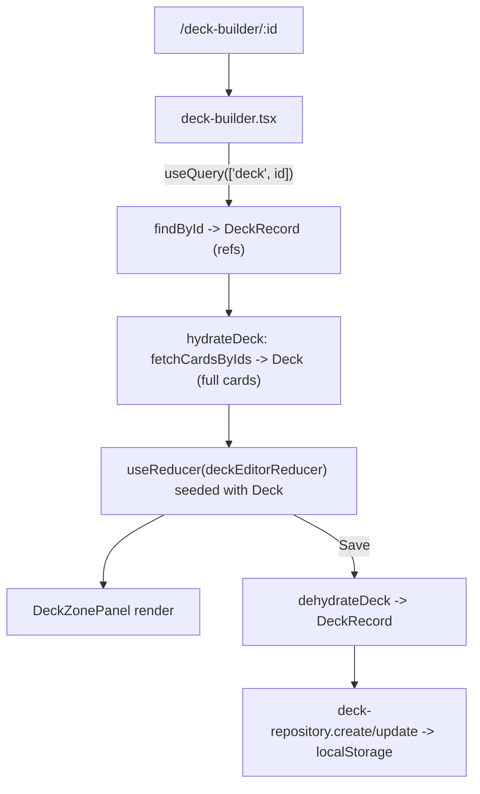

# Deck repository redesign

## Goal

Stop persisting full card objects. The deck "table" stores only `{ id, quantity }` per zone. The builder loads refs via `findById`, hydrates them into full cards via a separate function, renders from that, and persists edits back as refs. User decks only; prebuilt/public decks stay as-is. Old localStorage entries (full cards) are migrated down to refs on read.

## Data model (`src/types/deck.ts`)

Keep `Deck`/`DeckCardEntry` as the **in-memory enriched view** (full cards, used by UI). Add the **persisted** shape:

```ts
export interface DeckCardRef { id: number; quantity: number; }

export interface DeckRecord {
  id: string;
  name: string;
  archetype?: string;
  main: DeckCardRef[];
  extra: DeckCardRef[];
  side: DeckCardRef[];
  createdAt: string;
  updatedAt: string;
}
```

`SavedDeck` is retired from storage; list UI uses hydrated `Deck` + `updatedAt`.

## Layers / data flow



## Files

### New: `src/lib/decks/deck-repository.ts` (the dummy DB + CRUD)
- Owns localStorage key `deck-forge:decks`, stores `DeckRecord[]`.
- `findAll()`, `findById(id)`, `create(input)`, `update(id, patch)`, `remove(id)`.
- Migration on read: if a stored entry has `entry.card` (old full-card format), map to `{ id: entry.card.id, quantity }`; persist migrated shape back once.
- Guards: `isDeckRecord` / `isDeckCardRef`.

### New: `src/lib/decks/deck-hydration.ts`
- `hydrateDeck(record: DeckRecord): Promise<Deck>` — collect ids across zones, one `fetchCardsByIds`, map each ref to its `YugiohCard` (`src/lib/ygoprodeck.ts`).
- `dehydrateDeck(deck: Deck): Omit<DeckRecord,'createdAt'|'updatedAt'>` — extract `{ id, quantity }`.
- `toRefs(entries: DeckCardEntry[]): DeckCardRef[]`.

### New: `src/lib/decks/deck-editor.ts` (replaces the custom hook's logic)
- Pure `deckEditorReducer(state: Deck, action)` with `ADD_CARD`, `REMOVE_CARD`, `SET_NAME`, `RESET`, `REPLACE`, `HYDRATE`.
- Reuses `canAddCardToZone`, `getDefaultZoneForCard`, `createEmptyDeck` from `src/lib/deck-rules.ts`.

### Rewrite: `src/components/deck-builder/deck-builder.tsx`
- `useQuery({ queryKey: ['deck', deckId], queryFn })` where queryFn = `findById` + `hydrateDeck` (new deck => `createEmptyDeck`).
- `useReducer(deckEditorReducer)`, seeded from query data (HYDRATE on success / via remount key).
- Loading -> `DeckBuilderSkeleton`; missing record -> `DeckNotFound`.
- Save: `dehydrateDeck` -> `repository.create/update`, then `router.replace`.
- No more `useDeckBuilder`, no `initialDeck`, no full-card persistence.

### Delete: `src/hooks/use-deck-builder.ts`

### Update: `src/hooks/use-saved-decks.ts`
- Thin reactive wrapper over `deck-repository` returning raw `records`, plus `save(deck: Deck)` (dehydrate->upsert), `remove`, `ready`.

### Update: `src/app/my-decks/content.tsx`
- List needs full cards for `getMostPowerfulMonster` / `validateDeck`. Add a single `useQuery` that batch-hydrates all records (collect every id across decks -> one `fetchCardsByIds` -> build `Deck[]`). Counts can come from refs directly.

### Update: `src/lib/decks/deck-utils.ts`
- `clonePublicDeckToSaved`: convert the public deck's full entries to refs (`toRefs`) and call `repository.create`. Public deck data itself unchanged.

### Cleanup
- Replace/retire `src/lib/decks/deck-storage.ts` and the `src/lib/deck-storage.ts` re-export (point to repository or remove if unused).
- `tsc --noEmit` + lint; manual check: open migrated saved deck and a copied prebuilt -> zones render with full effects; edit + save round-trips as refs.

## Out of scope
- Prebuilt/public decks (`public-decks.ts`, `decks/[slug]`) keep their current full-entry shape.
- No schema-version field (simple in-place migration only).